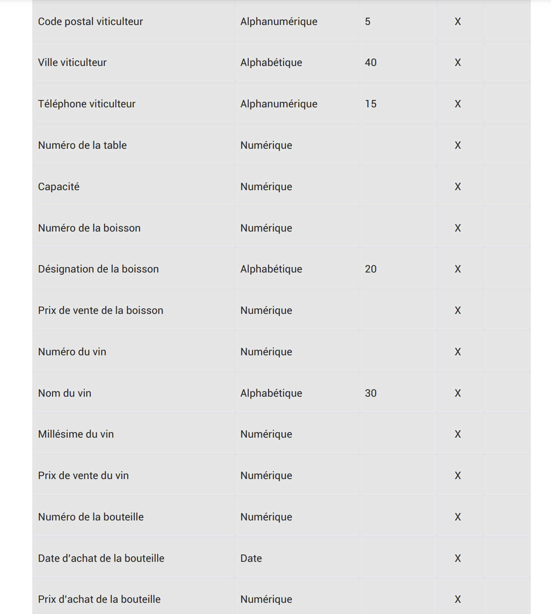
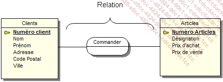
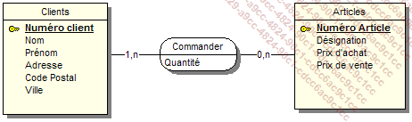
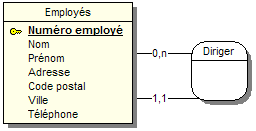

# Modelisation de donnees (Merise, MCD, MLD, MPD)

## 0. Informations sur la prise de notes et la notation

- Les notes sont prises en Markdown
- Tout rendu se fait avec un depot Git
- La qualite de la prise de note fera partie de la note finale

- Au cours de l'examen l'utilisation ou toute suspicion d'utilisation de chat GPT entrainera une note de 0

## 1. Introduction a Git

Pour creer un depot Git, placez vous au sein d'un repertoire et entrez la commande :

```sh
git init
```

Cette commande va initialiser un depot Git, Git va traquer les toutes les modifications effectuées au sein de ce dossier.

Pour consulter l'etat du depot Git il suffit de lancer la commande :

```bash
git status
```

Pour ajouter des fichiers non suivis :

```bash
git add .
```

Pour sauvegarder votre travail :

```bash
git commit -m "votre message de commit"
```

## 2. Merise

Merise est une méthode de modélisation de données. Elle permet de représenter les données d'un système d'information.
Merise est un acrnonyme de : Méthode d'Etude et de Réalisation Informatique pour les Systèmes d'Entreprise.

Presentation generale
Cette methode se caracterise par trois points clés:

- une approche dite systemique : on transforme les processus de l'entreprise en systeme d'information
- une separation des donnees et des traitements
- une approche nivelée

### L'approche systemique


Le systeme de pilotage:

- Il est compose de l'ensemble des acteurs qui vont **piloter** le systeme d'information

Le systeme d'information:

- Il est compose de l'ensemble des acteurs qui vont **utiliser** le systeme d'information

Le systeme operant :

- Il est compose de l'ensemble des acteurs qui vont **produire** les donnees du systeme d'information

### La separation des donnees et des traitements

La separation des donnees et des traitements permet de separer les donnees du systeme d'information et les traitements effectues sur ces donnees.
Cette demarche se fait en 3 etapes :

- L'analyse des flux : on analyse les flux d'informations entre les acteurs du systeme d'information et les acteurs du systeme operant
- L'etude des documents internes (factures, bon de livraison,)
- L'etude des documents en externes (fournisseurs, clients,).

Les differents types d'informations:

- les infos de bases ou elementaires : ce sont les donnees de base du systeme d'information
- les informations calculees : ce sont les donnees calculees a partir des donnees de base
- les traitements ou les fonctions : ce sont les traitements effectues sur les donnees de base pour obtenir les donnees calculees

En résumé : vous devrez identifier les données et les traitements effectués sur ces données.

### L'approche nivelée

Pour effectuer la conception d'un SI, on va utiliser une approche nivelée. Cette approche se compose de 4 niveaux :

- le niveau conceptuel
- le niveau organisationnel
- le niveau logique
- le niveau physique

#### Le niveau conceptuel

Le niveau conceptuel permet de modéliser les données de l'entreprise. On va utiliser le modèle conceptuel de données (MCD) pour modéliser les données de l'entreprise, et le MCT pour modéliser les traitements effectués sur ces données.

#### Le niveau organisationnel

Le niveau organisationnel va permettre d'integrer a l'analyse precedente toutes les notions de temporalite, de chronologie des operations, de contraintes geographique, niveau d'acces. On va utiliser le modele organisationnel des traitements (MOT) et le modele organisationnel des donnees (MOD) pour modéliser les traitements de l'entreprise.

En resume on se pose les questions suivantes a partir des donnees recueillies au niveau conceptuel :

- **Quand** les traitements sont-ils effectues ?
- **Où** les traitements sont-ils effectues ?
- Par **qui** les traitements sont-ils effectues ?

#### Le niveau logique

Le niveau logique va permettre de modéliser les données de l'entreprise en utilisant le modèle logique de données (MLD) et les traitements de l'entreprise en utilisant le modèle logique des traitements (MLT).

Le MLD est independant des langages de programmation et des SGBD (Systeme de Gestion de Base de Donnees).

On repond a la question : **Avec Quoi** les traitements sont-ils effectues ?

#### Le niveau physique

Il s'agit de l'organisation `réelle` des données. On va utiliser le modèle physique de données (MPD) et le modèle physique des traitements (MPT).

Ici, on apporte les solutions techniques de stockage des données et de traitement des données.

On repond a la question : **Comment** les traitements sont-ils effectues ?

#### Résumé: les 4 niveau de Merise


### Des donnees aux dependances fonctionnelles

Pour etre integrees dans un systeme d'information, les donnees doivent etre triees et organisees. On va souvent tenter de les classer par type de donnees :

- chaines de caracteres, format texte
- type alphanumerique, format texte
- le type numerique (integer, float...)
- le type date (date, datetime, timestamp)
- le logique ou booleen (true, false)

Creation d'un dictionnaire de donnees


##### Les dependances fonctionnelles

Une dependance fonctionnelle est une relation entre deux attributs d'une table. Elle permet de definir une relation de dependance entre deux attributs d'une table.

Le role d'une dependance fonctionnelle est de permettre de definir une relation de dependance entre deux attributs d'une table: une donnee A depend fonctionnellement d'une donnee B lorsque la valeur de B determine la valeur de A.

Pour formaliser une dependance fonctionnelle on utilise la notation suivante :
`Numero adherent (Nom, prenom, code postal, ville, telephone, date d'adhesion, mail)`

La partie gauche (numero adherent) est la `source` de la dependance fonctionnelle.
La partie droite desgine le `but` de la dependance.

##### Les dependances fonctionnelles composees

Si une dependance fonctionnelle qui fait intervenir plus de deux attributs (source) on parle de dependance fonctionnelle composee.

Exemple: Pour connaitre le temps d'un coureur sur une etape donnee il nous faut son numero ou son nom ainsi que le nom ou le numero de l'etape.

Formalisation :
`(numero coureur, numero etape)  (temps)`

##### Les dependances fonctionnelles elementaires

Une dependance fonctionnelle A -> B est elementaire s'il n'existe pas une donnee C, sous-ensemble de A, decrivant une dependance fonctionnelle type C -> B.

Exemples :

- RefProduit -> LibelleProduit
- NumCommande RefProduit -> QuantiteCommandee
- <strike>NumCommande RefProduit -> DesignationProduit</strike>

##### Dependance fonctionnelle elementaire directe

"On dit que la dépendance fonctionnelle A -> B est directe s’il n’existe aucun attribut C tel que l’on puisse avoir A -> C et C -> B. En d’autres termes, cela signifie que la dépendance fonctionnelle entre A et B ne peut pas être obtenue par transitivité."

Exemple :

- RefPromo -> NumApprenant
- NumApprenant -> NomApprenant
- RefPromo -> NomApprenant : RefPromo -> NumApprenant -> NomApprenant

##### Sujet TP/TD MCD jour 1





Le but de l'exercie est d'elaborer un MCD a partir d'un dictionnaire de donnees.

Ici on va introduire les notions d'entite, de relations et de propriétés.

##### Les proprietes sont les informations de bases d'un SI.

##### Les entités sont les objets du SI.


Quelques definitions:

    - entite forte: une entite qui ne depend pas d'une autre entite pour exister
    - entite faible: une entite qui depend d'une autre entite pour exister

##### Les relations



**Les cardinalités**: elles permettent de définir le nombre d'occurences d'une entité par rapport à une autre entité dans le cadre d'une relation.


Petit Exemple :


##### Les relations "porteuses"

Une relation est dite porteuse si elle possede des proprietes.




##### Les relations reflexives

Une relation est dite reflexive si elle relie une entite a elle meme.



##### Quelques regles de conception :

- toute entite doit avoir un identifiant
- toutes les proprietes dependent fonctionnellement de l'identifiant
- le nom d'une propriete ne doit apparaitre qu'une seule fois dans le MCD : si vous avez une entite Eleve et une entite Professeur, vous ne pouvez pas avoir une propriete nom dans les deux entites. Il faut donc renommer la propriete nom de l'entite Professeur en nomProfesseur par exemple.
- les proprietes issues d'un calcul ne doivent pas apparaitre dans le MCD

Installation d'AnalyseSI, pre requis java :

Sur windows, creez la variable d'environnement systeme `JAVA_HOME` et mettez la valeur du chemin d'installation de java.

```
C:\Program Files\Java\jdk1.8.0_121
```

Modifier la variable d'environnement `PATH` et ajoutez `%JAVA_HOME%\bin`

Pour tester le fonctionnement, ouvrez un terminal et tapez la commande `java -version`

##### Les contraintes d'integrite fonctionnelle (CIF)

Definition : Une CIF est definie par le fait qu'une des entites de l'association est completement determinee par la connaissance d'une ou de plusieurs entites participant a l'association.

Exemple :


Une Salle peut contenir 0 ou plusieurs Ordinateurs. Un ordinateur existe dans une et une seule salle.
Dans ce type de relation une CIF existe si on a une cardinalite 1,1

### Modele Logique des donnees (MLD)

Le MLD est la suite du processus Merise, on se rapproche un peu plus de la base de donnees.

#### Cas simple:
Partons du MCD suivant :


Nous arrivons au MLD suivant :


L'`entite` qui possede la cardinalite 1,1 ou 0,1 absorbe l'identifiant de l'entite la plus forte (0,n ou 1,n). Cet identifiant devient alors une cle etrangere.

#### Cas (0,n), (0,n) ou (1,n), (1,n)

Partons du MCD suivant :


Dans le cas ou la `cardinalite max` est n des deux cotes, on cree une entite intermediaire qui va contenir les deux cles etrangeres des deux entites.


Continuons avec le MCD suivant :


On obtient le MLD suivant en suivant la meme logique:


#### Cas d'une relation reflexive

Partons du MCD suivant :


#### Regles de passage du MCD au MLD

Règles simples de passage du MCD au MLD
L’entité qui possède la cardinalité maximale égale à 1 recevra l’identifiant ou les identifiants des entités ayant les cardinalités maximales les plus fortes.

Les relations ayant toutes leurs entités reliées avec des cardinalités maximales supérieures à 1 se transformeront en entité en absorbant les identifiants des entités jointes.

Toute relation porteuse de propriétés se transformera en entité et absorbera comme clé étrangère les identifiants des entités qui lui sont liées.

Toute relation réflexive se transformera en entité et absorbera comme clé étrangère l’identifiant de l’entité qui lui est liée.

##### Petit exercice pratique :


